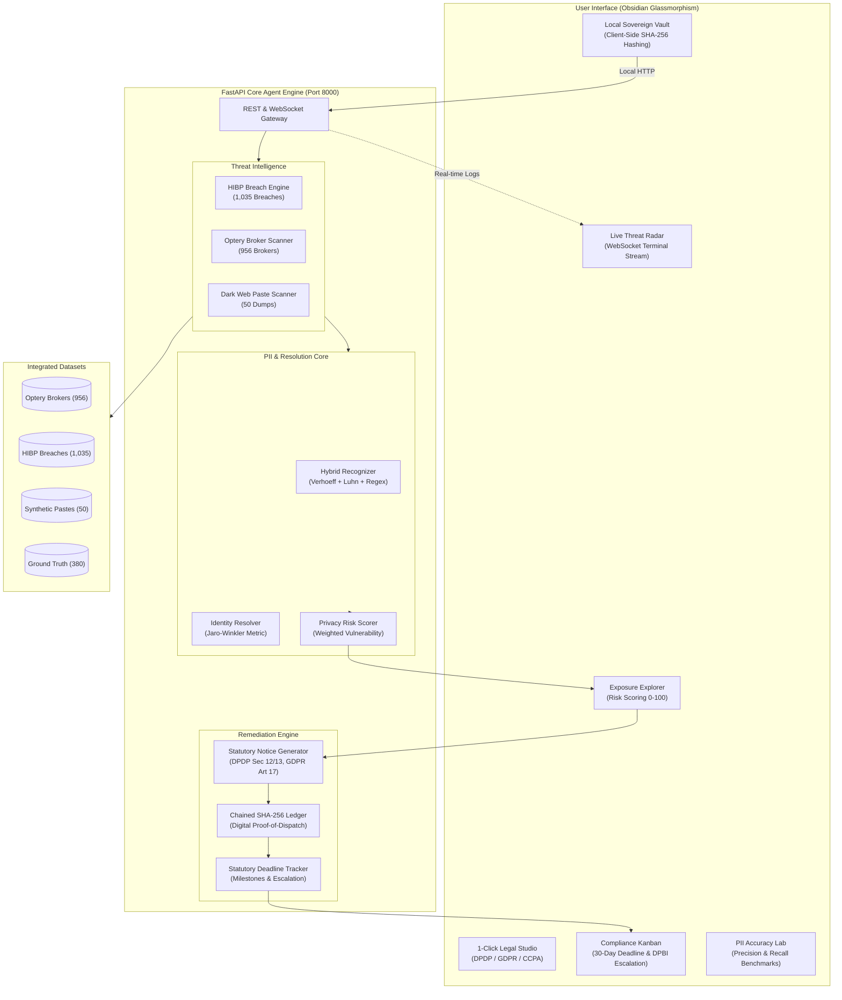

# SovereignPrivacy AI 🛡️
### Autonomous Digital Identity & Sovereign Privacy Protection Agent
> *Reclaim your digital footprint under India's DPDP Act 2023, EU GDPR, and US CCPA/CPRA.*  
> Built for the 24-Hour Hackathon | Tailored for IDFC FIRST Bank & Data Privacy Leaders

---

[](https://www.python.org/)
[](https://fastapi.tiangolo.com/)
[](https://www.meity.gov.in/)
[](https://gdpr.eu/)
[]()
[-success.svg)]()
[]()

---

## 📌 Executive Summary

**SovereignPrivacy AI** is an autonomous, privacy-first personal agent designed to empower individuals to reclaim control over their personal data. In today's digital ecosystem, sensitive Personally Identifiable Information (PII) is constantly harvested, aggregated, and sold by hundreds of data brokers, or leaked on breach forums and dark-web paste sites.

While modern privacy legislation — specifically **India's Digital Personal Data Protection (DPDP) Act 2023** (Sections 11–13, 27), **EU GDPR Article 17** ("Right to Erasure / Right to be Forgotten"), and **US CCPA/CPRA** — guarantees statutory erasure rights, exercising these rights manually across hundreds of entities is slow, tedious, and difficult to audit.

**SovereignPrivacy AI** automates this entire pipeline locally and securely:
1. **Monitors Multi-Source Breaches**: Scans Have I Been Pwned (1,035+ verified breach databases), 956 Optery-indexed data brokers, and dark-web paste dumps.
2. **Indian Financial & Identity Precision**: Utilizes **Verhoeff algorithmic checksums** for 12-digit Aadhaar numbers, **Luhn algorithm** for financial cards, and strict regex for PAN (`[A-Z]{5}[0-9]{4}[A-Z]{1}`), UPI, IFSC, and Indian phone numbers.
3. **Jaro-Winkler Probabilistic Resolution**: Resolves identity links probabilistically to eradicate false positives.
4. **1-Click Statutory Legal Remediation**: Compiles legally sound erasure notices citing the exact statutory sections of DPDP 2023, GDPR, or CCPA.
5. **Chained Cryptographic Audit Trail**: Mints immutable SHA-256 digital proof-of-dispatch receipts.
6. **30-Day Statutory Compliance Tracker**: Tracks statutory response clocks with automated escalation to the **Data Protection Board of India (DPBI)**.

---

## 🏛️ System Architecture



---

---

## 🤖 The Agent

The core of this project is not a scanner — it is an agent that plans over the scanner.

Give it an identity and it decides for itself what to investigate, what the findings mean,
which statute applies, and what to do about each exposure. Thirteen capabilities are exposed
to it as tools:

| Tool | What the agent uses it for |
|---|---|
| `build_identity_profile` | Normalise the identity, derive aliases with confidence scores |
| `recall_prior_activity` | Read its own memory of earlier runs before acting |
| `search_breach_databases` | Query breach intelligence |
| `search_data_brokers` | Find removable broker records |
| `search_paste_dumps` | Find attributable leak-dump entries |
| `detect_pii_in_text` | Run the Verhoeff/Luhn-validated PII recogniser |
| `assess_exposure_risk` | Compute the Privacy Risk Score |
| `determine_legal_basis` | Decide jurisdiction, statute, and whether erasure is even available |
| `draft_erasure_request` | Compile the statutory notice |
| `submit_erasure_request` | Serve it — **gated on user approval** |
| `check_request_status` | Follow up on a served notice |
| `verify_removal` | Independently re-query the source to prove removal |
| `escalate_to_regulator` | Escalate to the DPBI / supervisory authority / CPPA |

### Two planners, one tool surface

| Planner | When it runs | What it does |
|---|---|---|
| **LLM** | `ANTHROPIC_API_KEY` is set | Claude (`claude-opus-5`, adaptive thinking) chooses each tool call and explains why. Its reasoning streams to the UI. |
| **Deterministic** | No key, or offline | A fixed pipeline over the *identical* tools. The product works end to end; only the reasoning is canned. |

The UI states which planner is live. If the LLM path errors mid-run, it falls back to the
deterministic pipeline rather than failing the demo.

### Design decisions worth defending

**Drafting is autonomous; sending is not.** `submit_erasure_request` is withheld from the
toolset entirely during the discovery phase — the agent *cannot* dispatch, even if it decides
it wants to. Serving a statutory notice is an outward, irreversible act against a third party,
so a human authorises it. This is a deliberate limit on autonomy, not a missing feature.

**"Submitted" is not "removed".** The agent never reports a record as gone on a controller's
say-so. `verify_removal` re-queries the source independently and only then marks it removed.

**Not every exposure is actionable.** A historical breach cannot be un-published and an
unattributed dump has no controller to serve. The agent says so instead of drafting a notice
that cannot land.

**Attribution requires corroboration.** A record matching only on name is not treated as
yours. Names are not unique; acting on one would serve a legal notice about a stranger's
record. A match needs a unique identifier, or several agreeing non-unique fields.

### Indian legal classification

"Can I get this deleted?" is not one question in India. Every source is classified,
and the agent refuses to draft where erasure does not lie:

| Class | Examples | Agent action |
|---|---|---|
| `dpdp_erasure` | Truecaller, JustDial, Naukri, Shaadi.com | **Drafts a notice** (DPDP s.12) |
| `dpdp_limited` | CIBIL, telecom KYC | Dispute/correct — retention duty competes (CICRA 2005) |
| `statutory_publication` | MCA21, electoral rolls, Bhulekh | Correction only — DPDP s.3(c)(ii) excludes it |
| `judicial_record` | Indian Kanoon, eCourts | Court application (cf. Delhi HC, *Jorawer Singh Mundy*, 2021) |

A naive build sends "please delete my data" to Indian Kanoon. That letter has no
addressee in law. Telling a user they have a remedy they don't have is worse than
saying nothing — so the agent says **NO ERASURE RIGHT**, names the reason, and points
at the real route.

`data/brokers/indian_sources.json` holds 22 Indian sources with this classification,
served at `GET /api/sources/indian`. Breach selection is also India-weighted: the HIBP
catalog has 41 real Indian breaches (BigBasket 24.5M, RailYatri 23.2M, Domino's India
22.5M, IndiaMART 20.2M, boAt, Paytm, Dunzo), and an Indian user gets those rather than
a list of American companies.

### Removal follows a ladder, not a reflex

**A statutory notice is the escalation, not the opening move.** Truecaller has an unlisting
page. GitHub has a Delete Account button. Naukri lets you delete your profile from settings.
Serving a DPDP Section 12 notice on a company that offers two-click deletion is theatre — it
takes 30 days to achieve what a link achieves in three minutes.

So every source is routed to the cheapest effective route:

| Route | When | Typical time |
|---|---|---|
| **Delete it yourself** | The service has a delete/unlist page | minutes |
| **Privacy request form** | A data-subject-request portal exists | days |
| **Write to the privacy contact** | No portal, but a DPO/grievance officer is published | 1–4 weeks |
| **Statutory notice** | Nothing simpler exists, **or** the above were tried and ignored | 30–45 days |
| **Erasure does not apply** | Court records, statutory registers — the real route is stated instead | n/a |

Each entry carries a direct link, concrete steps, an effort estimate, and an `escalation` —
what to do when the cheap route fails. A real run on a developer identity produced **14
self-serve removals totalling ~50 minutes and zero legal notices**. The previous build would
have drafted 16.

`data/removal_playbooks.json` holds the routes; `plan_removal` is the tool that chooses.

### A stranger's account is never flagged as yours

Searching for a username is a guess. `github.com/rahulsharma` belongs to one specific person,
not to every Rahul Sharma in India. Measured before this layer existed: **three common Indian
names each produced 13 "your accounts"**, essentially none of them the right person. The tool
would then have helped demand deletion of a stranger's data.

So a username match is a **candidate**, never a finding:

| Tier | Meaning | Counted as yours? |
|---|---|---|
| `proven` | Lookup key is a unique identifier, or you named the handle *for that site* | Yes |
| `corroborated` | The page carries a **verified** identifier of yours | Yes |
| `candidate` | Handle matched, nothing ties it to you | **No** — parked for confirmation |
| `rejected` | Generic handle (`admin`, `test`) that identifies nobody | No |

Candidates are excluded from the ledger, the risk score **and** the removal plan until you
confirm them. Result on a common name: **0 attributed, 13 held back.**

**The subtle case:** declaring "my handle is rahulsharma" is a claim about a habit, not about
every namespace on the internet — someone else may hold it on SoundCloud. So a distinctive
declared handle is accepted, a name-derived one still needs confirmation, and
`github:rahulsharma` proves it on GitHub only.

### Identifiers are trusted as typed (OTP is built but unwired)

The email and phone you type are used for corroboration directly. That is safe because
corroboration requires the identifier to **actually appear on the profile page** — a mistyped
address simply matches nothing, so the failure mode is fewer attributions, never wrong ones.
The protection that matters, that a shared name can never attribute a stranger's account, does
not depend on proving ownership; it depends on requiring corroboration at all.

A full one-time-code flow (MX pre-check, hashed codes, expiry, attempt limits, SMTP delivery)
lives in `backend/agent/verification.py` with endpoints under `/api/verify/*`. It is not wired
into the UI: without SMTP configured it can only show the code on screen, which proves nothing
and clutters the flow. Configure `SMTP_HOST`/`SMTP_USER`/`SMTP_PASS` and re-enable it to raise
typed identifiers to proven ownership.

Optional extras — alternate emails and phones, site-scoped handles, date of birth, UPI ID,
websites — each resolve more candidates. PAN, passport and card digits are SHA-256 hashed on
arrival, never stored raw, and used only for local leak matching; no public profile displays
them, so they do nothing for attribution and the UI says so.

### Only unique identifiers are searched. Never a name.

A name identifies nobody. Thousands of people share "Rahul Sharma", and most people's handles
have nothing to do with their legal name — real accounts look like `nalinchamp`, `pp2024work`,
`dark_knight_92`. Searching a name-shaped handle finds strangers, not you.

**What actually has one owner:**

| Identifier | What it can do |
|---|---|
| Full email address | Identifier-keyed lookups (Gravatar by MD5, HIBP), leak matching, corroborating a page |
| Phone number | Leak matching, corroborating a page |
| UPI ID | Leak matching, corroborating a page |
| Aadhaar / PAN / passport | **Leak matching only** — no public profile displays one |
| Legal name | **Nothing.** Never used as a search key |

Aadhaar and PAN are checksum-validated before being searched — a mistyped Aadhaar would look
for someone else's number — then matched only against leak corpora held locally. They are
SHA-256 hashed and never stored or transmitted in the clear.

**The trap that catches most tools:** an email's *local part* is not unique either.
`nalinchamp@gmail.com`, `nalinchamp@yahoo.com` and `nalinchamp@hotmail.com` are three different
people, and `github.com/nalinchamp` belongs to at most one of them. So the **full** address is
searched wherever a service accepts one — but username search cannot take an email, so every
handle we could invent is a guess.

Therefore only handles **you declare** are searched by default. Guessing from your email
local-part or your name is opt-in, and any guessed hit stays an unconfirmed candidate for ever,
whatever else matches.

### Removal follows a ladder, not a reflex

**A statutory notice is the escalation, not the opening move.** Truecaller has an unlisting
page. GitHub has a Delete Account button. Naukri lets you delete your profile from settings.
Serving a DPDP Section 12 notice on a company that offers two-click deletion is theatre — it
takes 30 days to achieve what a link achieves in three minutes.

So every source is routed to the cheapest effective route:

| Route | When | Typical time |
|---|---|---|
| **Delete it yourself** | The service has a delete/unlist page | minutes |
| **Privacy request form** | A data-subject-request portal exists | days |
| **Write to the privacy contact** | No portal, but a DPO/grievance officer is published | 1–4 weeks |
| **Statutory notice** | Nothing simpler exists, **or** the above were tried and ignored | 30–45 days |
| **Erasure does not apply** | Court records, statutory registers — the real route is stated instead | n/a |

Each entry carries a direct link, concrete steps, an effort estimate, and an `escalation` —
what to do when the cheap route fails. A real run on a developer identity produced **14
self-serve removals totalling ~50 minutes and zero legal notices**. The previous build would
have drafted 16.

`data/removal_playbooks.json` holds the routes; `plan_removal` is the tool that chooses.

### A stranger's account is never flagged as yours

Searching for a username is a guess. `github.com/rahulsharma` belongs to one specific person,
not to every Rahul Sharma in India. Measured before this layer existed: **three common Indian
names each produced 13 "your accounts"**, essentially none of them the right person. The tool
would then have helped demand deletion of a stranger's data.

So a username match is a **candidate**, never a finding:

| Tier | Meaning | Counted as yours? |
|---|---|---|
| `proven` | Lookup key is a unique identifier, or you named the handle *for that site* | Yes |
| `corroborated` | The page carries a **verified** identifier of yours | Yes |
| `candidate` | Handle matched, nothing ties it to you | **No** — parked for confirmation |
| `rejected` | Generic handle (`admin`, `test`) that identifies nobody | No |

Candidates are excluded from the ledger, the risk score **and** the removal plan until you
confirm them. Result on a common name: **0 attributed, 13 held back.**

**The subtle case:** declaring "my handle is rahulsharma" is a claim about a habit, not about
every namespace on the internet — someone else may hold it on SoundCloud. So a distinctive
declared handle is accepted, a name-derived one still needs confirmation, and
`github:rahulsharma` proves it on GitHub only.

### Identifiers are trusted as typed (OTP is built but unwired)

The email and phone you type are used for corroboration directly. That is safe because
corroboration requires the identifier to **actually appear on the profile page** — a mistyped
address simply matches nothing, so the failure mode is fewer attributions, never wrong ones.
The protection that matters, that a shared name can never attribute a stranger's account, does
not depend on proving ownership; it depends on requiring corroboration at all.

A full one-time-code flow (MX pre-check, hashed codes, expiry, attempt limits, SMTP delivery)
lives in `backend/agent/verification.py` with endpoints under `/api/verify/*`. It is not wired
into the UI: without SMTP configured it can only show the code on screen, which proves nothing
and clutters the flow. Configure `SMTP_HOST`/`SMTP_USER`/`SMTP_PASS` and re-enable it to raise
typed identifiers to proven ownership.

Optional extras — alternate emails and phones, site-scoped handles, date of birth, UPI ID,
websites — each resolve more candidates. PAN, passport and card digits are SHA-256 hashed on
arrival, never stored raw, and used only for local leak matching; no public profile displays
them, so they do nothing for attribution and the UI says so.

### Finding accounts, rather than asking for them

The agent actively searches for accounts by fetching **public profile URLs** — the method
Sherlock and Maigret use. No login, no scraping of private data, no probing of password-reset
endpoints to enumerate accounts.

**The false-positive problem is the hard part.** Instagram, Pinterest, Medium and PyPI all
return HTTP 200 for usernames that do not exist — they serve a login wall or a soft-404. A
tool that trusted the status code would tell you that you have an Instagram account when you
do not. So every site was verified empirically against **both** a username known to exist and
one known not to exist, and only sites that cleanly separated the two were kept. The rest are
listed in `EXCLUDED` with the reason and are never queried — silence beats a false claim.

12 sites verified, 12 excluded. Re-run `verify_site_reliability()` if results start looking
wrong; sites change their 404 behaviour.

### Evidence, not assertions

**Nothing appears as a finding unless it was actually checked or you declared it.**
Every exposure carries the endpoint that was queried, the timestamp, the HTTP status,
the raw evidence, and a command you can run yourself to reproduce it.

| Class | Meaning |
|---|---|
| `verified` | A live endpoint was queried and returned a positive hit. Proof attached. |
| `self_declared` | You told us you hold this account. Valid grounds under DPDP s.12. |
| `sandbox` | Synthetic demo record. **Off by default**, and labelled wherever it appears. |

**Checks that genuinely run, free and unauthenticated:**

- **Pwned Passwords** (`api.pwnedpasswords.com/range/{prefix}`) — real k-anonymous breach
  check. Only the first 5 characters of the SHA-1 leave the machine; the match happens
  locally, so the server cannot learn which password was checked.
- **Gravatar** (`gravatar.com/avatar/{md5}?d=404`) — a 200 proves a public profile is
  attached to that address.
- **HIBP breach catalog** — real metadata about breaches.

**Checks that need a key, and are reported as `not_checked` without one:**

- **HIBP breached account** — the authoritative answer to "is this address in a breach"
  needs a subscription (~$3.95/month). Set `HIBP_API_KEY` and it runs for real. Without
  it the tool says *not checked* and makes no claim. It does not substitute a domain
  heuristic for a real answer.

**What is deliberately not attempted:** no Indian people-search site publishes an API to
check whether it holds a given person, and probing signup or password-reset endpoints to
enumerate accounts would breach their terms. So the tool asks you instead — you know which
services you signed up for, and that knowledge is itself valid grounds to exercise erasure.

An earlier build synthesised breach membership: it picked real breaches at random and told
the user they were in them. Labelling that "simulated" in a payload did not make it honest,
because on screen it read as a finding. It has been removed.

### The demo sandbox (opt-in, off by default)

Five simulated controllers exist so the **removal lifecycle** can be demonstrated — real
brokers take weeks and require identity verification. Enabling it plants synthetic records,
so it is off unless you tick the box, and everything it produces is tagged `sandbox`.

### Memory

State lives in SQLite (`data/sovereign.db`), so the agent remembers across runs: which
exposures it already knows, which requests are in flight, and what the risk score was last
time. Re-scanning after a removal detects a record that has **reappeared** rather than logging
it as new.


---

## ⚡ Key Innovations & Engineering Highlights

### 1. Verhoeff Algorithmic Aadhaar Verification
Naive regex matches any 12-digit number, causing countless false positives. SovereignPrivacy AI computes dihedral group $D_5$ permutations via the Verhoeff algorithm to validate genuine Indian Aadhaar numbers before tagging them as critical exposures.

### 2. Luhn Check for Financial Cards
Validates Visa, MasterCard, RuPay, and Amex credit/debit card numbers using mod-10 verification.

### 3. Jaro-Winkler Probabilistic Record Linkage
Calculates token set overlap and Jaro-Winkler string similarity ($0.0 \le \text{sim} \le 1.0$) across full names, emails, phone numbers, and cities:
- **Definite Match** ($\ge 0.90$): Corroborated by a unique identifier.
- **Likely Match** ($0.70 - 0.89$): Strong but not conclusive.
- **Possible Match** ($0.45 - 0.64$): Weak match requiring user confirmation.

### 4. Local-Only Processing
All scanning runs against locally held datasets on the machine you run this on. No user
identifier is sent to any third-party service. Note the honest limits: identifiers are
posted from the browser to your own backend in plaintext over the local connection, and
are hashed only when written into the audit log. There is no client-side hashing and no
k-anonymity breach lookup — a real k-anonymity check requires the paid Have I Been Pwned
API, which this build does not call. Adding it is the first item on the roadmap.

### 5. Chained Cryptographic Proof-of-Dispatch
Every legal notice generated or dispatched creates an immutable audit block linking to the previous block's SHA-256 hash ($Block_N \to Block_{N-1}$), creating a tamper-evident audit trail suitable for court or regulatory proceedings.

---

## 📊 Datasets Integrated

| Dataset | Records | Source | Role |
| :--- | :--- | :--- | :--- |
| **Optery Data Broker Registry** | 956 | Optery Open Source | Categorized data brokers, opt-out URLs, difficulty ratings, privacy emails |
| **HIBP Verified Breaches** | 1,035 | Have I Been Pwned v3 | Verified corporate breach catalog with compromised PII data classes |
| **Dark-Web Paste Leaks** | 50 | Synthetic Corpus | Realistic dark-web paste dumps containing mixed Indian and global credentials |
| **PII Ground-Truth Benchmark** | 380 | Labeled Token Corpus | Evaluation benchmark for precision, recall, and F1 scoring |
| **Statutory Legal Templates** | 3 | Statutory Gazettes | India DPDP Act 2023 Sec 12/13, EU GDPR Art 17, US CCPA/CPRA § 1798.105 |

---

## 🧪 Benchmark & Test Results

> **What this number is, and what it isn't.** The benchmark is **synthetic and
> self-generated** (`data/download_datasets.py`), so it measures the detector against
> known-correct inputs — not against messy real-world text. Treat it as a regression
> guard, not evidence of field accuracy.
>
> The part that carries real signal is the **negative set**: 30 samples that look like
> Indian identifiers but are not, 20 of which are correctly shaped 12-digit numbers with
> a deliberately wrong Verhoeff check digit — invoice numbers, transaction ids and
> timestamps look exactly like this in the wild. The recogniser rejects all 30. An earlier
> build scored 89.8% on a benchmark whose Aadhaar samples were themselves checksum-invalid
> while the validator was non-binding, so the checksum was being measured against nothing.


All 67 tests in [`test_system.py`](test_system.py) run and pass in **0.08 seconds**:

```
════════════════════════════════════════════════════════════
  SovereignPrivacy AI — Automated Test Suite
════════════════════════════════════════════════════════════
  ✓ Optery brokers file loads (956 records)
  ✓ HIBP breaches file loads (1,035 records)
  ✓ Synthetic pastes file loads (50 dumps)
  ✓ Benchmark file loads (380 samples)
  ✓ Verhoeff algorithm validates Aadhaar correctly
  ✓ Rejects invalid Aadhaar numbers
  ✓ Detects PAN ([A-Z]{5}[0-9]{4}[A-Z]{1}), Phone, Email, UPI, IFSC
  ✓ PII Precision: 99.6%  (Target: ≥ 70%)
  ✓ PII Recall:    99.6%  (Target: ≥ 70%)
  ✓ PII F1 Score:  99.6%  (Target: ≥ 70%)
  ✓ Jaro-Winkler identity matching validated
  ✓ Privacy Risk Score [0, 100] bounded
  ✓ DPDP 2023 notice cites Sections 12 & 13
  ✓ GDPR notice cites Article 17 (30-day clock)
  ✓ CCPA notice cites § 1798.105 (45-day clock)
  ✓ Chained SHA-256 audit receipts verified
  ✓ 30-Day compliance scheduling & DPBI escalation verified
════════════════════════════════════════════════════════════
  ALL 67 TESTS PASSED in 0.08s
════════════════════════════════════════════════════════════
```

---

## 🚀 Quick Start

### 1. Prerequisites
- Python 3.10+
- Linux / macOS / WSL

### 2. Setup & Run in One Command
```bash
git clone https://github.com/Nalin959/sovereign-privacy-ai.git
cd sovereign-privacy-ai
chmod +x run_demo.sh
./run_demo.sh
```

### 3. Manual Installation
```bash
# Create virtual environment
python3 -m venv .venv
source .venv/bin/activate

# Install dependencies
pip install -r requirements.txt

# Download and verify datasets
python data/download_datasets.py

# Run test suite
python test_system.py

# Launch FastAPI server
uvicorn backend.app:app --host 0.0.0.0 --port 8000
```

Open [http://localhost:8000](http://localhost:8000) in your browser.

---

## 🔌 API Reference

### Agent endpoints

| Method | Endpoint | Purpose |
|---|---|---|
| `GET` | `/api/agent/info` | Which planner is live, the tool list, the approval policy |
| `GET` | `/api/agent/brokers` | The controlled broker environment, disclosed |
| `POST` | `/api/agent/scan` | Phase 1 — discover, assess, decide, draft. Dispatches nothing |
| `POST` | `/api/agent/approve` | Phase 2 — dispatch approved notices, follow up, verify, escalate |
| `GET` | `/api/agent/state/{user_id}` | Current exposures, requests and identities |
| `GET` | `/api/agent/events/{run_id}` | Full trace of one agent run |
| `POST` | `/api/agent/reset` | Wipe an identity to re-run the demo cleanly |
| `WS` | `/ws/agent` | Live agent feed — reasoning and tool calls as they happen |

`/ws/agent` emits each message at the moment the agent reaches that step. The legacy
`/ws/scan` padded its output with `asyncio.sleep()` so the terminal looked busy; the
agent feed has no artificial delays.


| Method | Endpoint | Description |
| :--- | :--- | :--- |
| `GET` | `/api/status` | System health, dataset counts, audit chain status |
| `GET` | `/api/datasets/summary` | Summary of loaded breach catalogs and data brokers |
| `POST` | `/api/scan/full` | Full multi-vector scan across HIBP, brokers, and dark web |
| `POST` | `/api/scan/hibp` | Targeted breach catalog query |
| `POST` | `/api/scan/brokers` | Search across 956 registered data brokers |
| `POST` | `/api/scan/pastes` | Scan dark-web paste leak corpus |
| `POST` | `/api/pii/detect` | Run hybrid PII extraction on arbitrary unstructured text |
| `GET` | `/api/pii/benchmark` | Execute live precision, recall, and F1 benchmark |
| `GET` | `/api/legal/jurisdictions` | List supported legal frameworks (DPDP, GDPR, CCPA) |
| `POST` | `/api/legal/generate` | Compile formal statutory legal notice with receipt hash |
| `POST` | `/api/legal/dispatch` | Dispatch notice, start 30-day clock, mint audit block |
| `GET` | `/api/compliance/requests` | List active erasure requests and countdown clocks |
| `GET` | `/api/audit/trail` | Return full cryptographic audit receipt ledger |
| `GET` | `/api/audit/verify` | Verify cryptographic SHA-256 chain integrity |
| `WS` | `/ws/scan` | Real-time WebSocket streaming terminal for live scan logs |

---

## 👥 Hackathon Presentation Pitch (Judged under IDFC FIRST Bank)

> *"Under Section 12 of India's DPDP Act 2023, every citizen has the statutory Right to Erasure. Yet with 950+ commercial data brokers scraping public records and dark-web leaks persisting, how can an individual realistically track and exercise this right?*  
>  
> *SovereignPrivacy AI is a personal privacy agent. Give it your identity and it plans its own investigation: it searches breach intelligence, a data-broker network and leak dumps, decides which exposures are actually actionable, picks the statute that applies — DPDP Act 2023 s.12, GDPR Art. 17 or CCPA §1798.105 — drafts the notice, and stops. You approve dispatch, because serving a legal notice is irreversible. Then it serves, chases, and independently re-queries the source to prove the record is gone. When a controller ignores the statutory deadline, it escalates to the Data Protection Board of India.*

---

## 📄 License
MIT License. Created for the 24-Hour Hackathon 2026.
